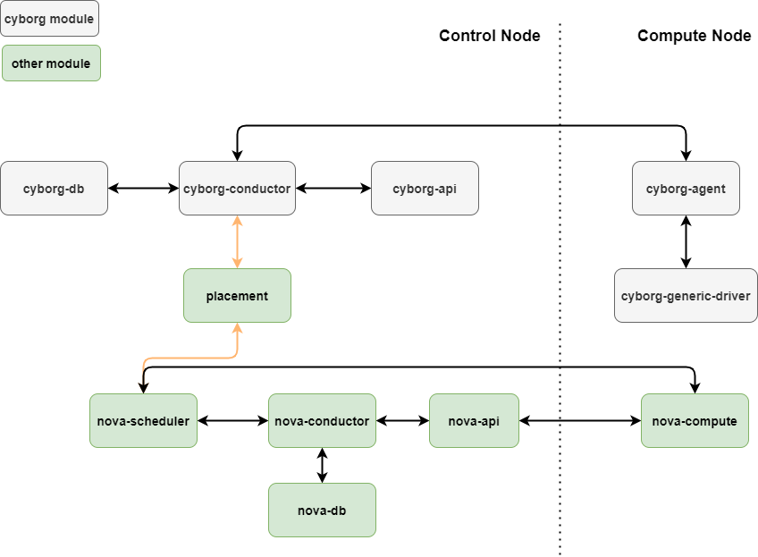
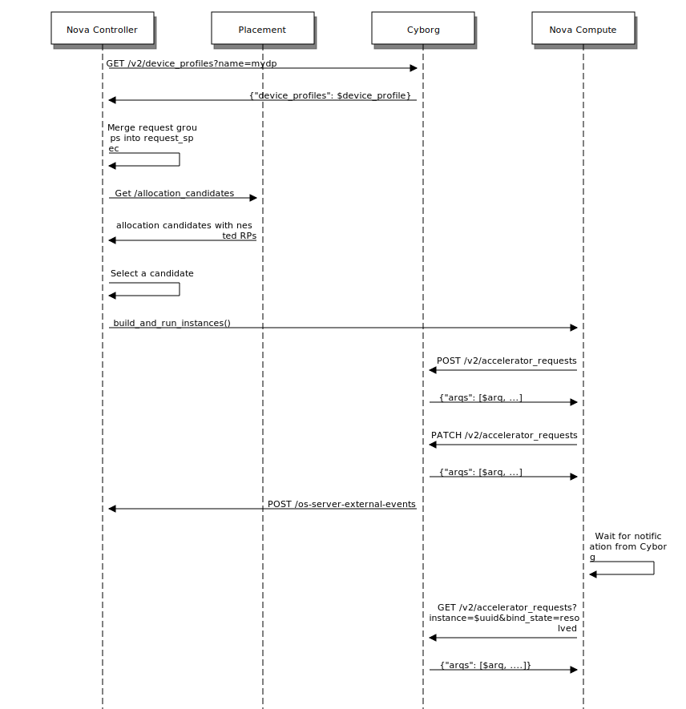

====================
Acceleration Service
====================

The OpenStack Cyborg is running as an acceleration service that allows you to
manage the lifecycle of accelerating for an instance in cloud computing
platform. It gives you control over accelerators attached to instances easily.

Overview
--------

A good understand on how Cyborg interacts with Nova and Placement help
operators manage the acceleration service more effectively.

Coexistence with PCI whitelists
-------------------------------

The operator tells Nova which PCI devices to claim and to be used by
configuring the PCI Whitelists mechanism. In addition, the operator installs
Cyborg drivers in compute nodes and configures/enables them. Those drivers may
then discover and report some PCI devices. The operator must ensure that both
configurations are compatible.

Ideally, there is a single way for the operator to identify which PCI
devices should be claimed by Nova and which by Cyborg. Until that is figured
out, the operator shall use Cyborg’s configuration file to specify which Cyborg
drivers are enabled. Since each driver claims specific PCI IDs, the operator
can and must ensure that none of these PCI IDs are included in Nova’s PCI
whitelist.

Placement update
----------------

Cyborg conductor calls Placement API directly to represent devices and
accelerators. Some of the intended use cases for the API invocation are:

* Create or delete child RPs under the compute node RP.

* Create or delete custom RCs and custom traits.

* Associate traits with RPs or remove such association.

* Update RP inventory.

Cyborg shall not modify the RPs created by any other component, such as Nova
virt drivers.

User Requests
-------------

The user request for accelerators is encapsulated in a device profile,
which is created and managed by the admin via the Cyborg API.

The structure overview of a `device_profile` is like this:

.. code:: json

  {
      "device_profiles":[
        {
            "name":"fpga-dp1",
            "uuid":"5518a925-1c2c-49a2-a8bf-0927d9456f3e",
            "description": "",
            "groups":[
              {
                "trait:CUSTOM_FPGA_TRAITS":"required",
                "resources:FPGA":"1",
                "accel:bitstream_id":"d5ca2f11-3108-4426-a11c-a959987565df"
              }
            ],
            "created_at": "2020-03-10 03:52:15+00:00",
            "updated_at": null,
            "links":[
              {
                "href":"http://192.168.32.217/accelerator/v2/device_profiles/5518a925-1c2c-49a2-a8bf-0927d9456f3e",
                "rel":"self"
              }
            ]
        }
      ]
  }

The device profile is folded into the flavor as an extra spec by the operator,
as below:

.. code:: bash

    openstack flavor set --property 'accel:device_profile=<profile_name>' flavor

Thus the standard Nova API can be used to create an instance with only the
flavor (without device profiles), like this:

.. code:: bash

    openstack server create --flavor f ....  # instance creation

In the future, device profile may be used by itself to specify accelerator
resources for the instance creation API.

Updating the Request Spec
-------------------------

When the user submits a request to create an instance, as described in Section
User Requests, Nova needs to call a Cyborg API, to get back the resource
request groups in the device profile and merge them into the request spec.

This call, like all the others that Nova would make to Cyborg APIs, is done
through a Keystone-based adapter that would locate the Cyborg service, similar
to the way Nova calls Placement. A Cyborg client module added to Nova, will
encapsulate such calls.

VM images in Glance may be associated with image properties (other than image
traits), such as bitstream/function IDs needed for that image. So, Nova should
pass the VM image UUID from the request spec to Cyborg.

The groups in the device profile are numbered by Cyborg. The request groups
that are merged into the request spec are numbered by Nova. These numberings
would not be the same in general, i.e., the N-th device profile group may not
correspond to the N-th request group in the request spec.

When the device profile request groups are added to other request groups in the
flavor, the group_policy of the flavor shall govern the overall semantics of
all request groups.

Accelerator Requests
--------------------

An accelerator request (ARQ) is an object that represents the state of the
request for an accelerator to be assigned to an instance. The creation and
management of ARQs are handled by Cyborg, and ARQs are persisted in Cyborg
database.

An ARQ represents a request for a single accelerator by definition. The
device profile in the user request may have N request groups, each asking for M
accelerators, then N * M ARQs will be created for that device profile.

When an ARQ is initially created by Cyborg, it is not yet associated with a
specific host name or a device resource provider. So it is said to be in an
unbound state. Subsequently, Nova calls Cyborg to bind the ARQ to a host name,
a device RP UUID and an instance UUID. If the instance fails to spawn, Nova
would unbind the ARQ with deleting it. On instance termination, Nova would
delete the ARQs after unbinding them.

Each ARQ needs to be matched to the specific RP in the allocation candidate
that Nova has chosen, before the ARQ is bound. The current Nova code maps
request groups to RPs, while the Cyborg client module in Nova
(cyborg-client-module) matches ARQs to request groups. The matching is done
using the request_id field in the RequestGroup object as below:

* The order of request groups in a device profile is not significant, but it is
  preserved by Cyborg. Thus, each device profile request group has a unique
  index.

* When the device profile request groups returned by Cyborg are added to the
  request spec, the request_id field is set to ‘device_profile_<N>’ for the
  N-th device profile request group (starting from zero). The device profile
  name need not be included here because there is only one device profile per
  request spec.

* When Cyborg creates an ARQ for a device profile, it embeds the device profile
  request group index in the ARQ before returning it to Nova.

* The matching is done in two steps:

  * Each ARQ is mapped to a specific request group in the request spec using
    the request_id field.

  * Each request group is mapped to a specific RP using the same logic as the
    Neutron bandwidth provider.

Cyborg and Nova interaction workflow
------------------------------------

This flow is captured by the following sequence diagram, in which the Nova
conductor and scheduler are together represented as the Nova controller.

A Cyborg client module is added to nova (cyborg-client-module). All Cyborg API
calls are routed through that.

1. The Nova API server receives a `POST /servers` API request with a flavor
   that includes a device profile name.

2. The Nova API server calls the Cyborg API
   `GET /v2/device_profiles?name=$device_profile_name` and gets back the device
   profile. The request groups in that device profile are added to the request
   spec.

3. The Nova scheduler invokes Placement and gets a list of allocation
   candidates. It selects one of those candidates and makes claim(s) in
   Placement. The Nova conductor then sends a RPC message
   build_and_run_instances to the Nova compute manager.

4. Nova conductor manager calls the Cyborg API `POST /v2/accelerator_requests`
   with the device profile name. Cyborg creates a set of unbound ARQs for that
   device profile and returns them to Nova.

5. The Cyborg client in Nova matches each ARQ to the resource provider picked
   for that accelerator.

6. The Nova compute manager calls the Cyborg API
   `PATCH /v2/accelerator_requests` to bind the ARQ with the host name,
   device’s RP UUID and instance UUID. This is an asynchronous call which
   prepares or reconfigures the device in the background.

7. Cyborg, on completion of the bindings (successfully or otherwise),
   calls Nova’s `POST /os-server-external-events` API with:

.. code::

    {
        "events": [
            { "name": "accelerator-request-bound",
                "tag": $arq_uuid,
                "server_uuid": $instance_uuid,
                "status": "completed" # or "failed"
            },
            ...
        ]
    }

8. The Nova compute manager waits for the notification, subject to the timeout
   mentioned in Section Other deployer impact. It then calls the Cyborg REST
   API `GET /v2/accelerator_requests?instance=<uuid>&bind_state=resolved` to
   get the arqs in status ['Bound', 'BindFailed', 'Deleting'].

9. The Nova virt driver uses the bound arqs returned from the Cyborg call
   to compose PCI passthrough devices into the VM’s definition.

10. If there is any error after binding has been initiated, Nova must unbind
    the relevant ARQs by calling Cyborg API. It may then retry on another host
    or delete the (unbound) ARQs for the instance.
