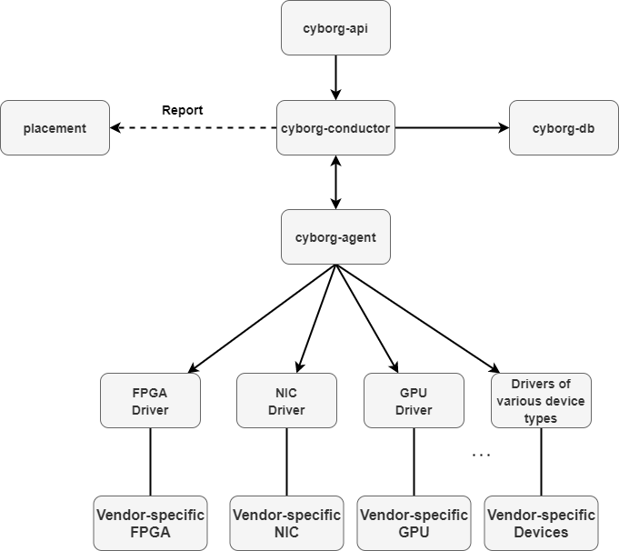

==============================
OpenStack Accelerator (Cyborg)
==============================

Cyborg is a general management framework for accelerators such as FPGAs, GPUs,
NICs, SSDs, and AI chips in OpenStack clouds.

Architecture Overview
=====================

Cyborg design can be described by the following diagram:

``cyborg-api``
    REST API service that handles device profile queries, ARQ creation, and
    accelerator discovery. Supports POST/PUT/DELETE/GET operations and
    interacts with cyborg-agent and the database via cyborg-conductor.

``cyborg-conductor``
    Central orchestration service that coordinates placement updates, device
    bindings, and database access between cyborg-api and cyborg-agent.

``cyborg-agent``
    Runs on compute nodes and discovers local accelerators via drivers,
    reports inventory to the conductor, and manages device programming and
    attachment. See :doc:`admin/support-matrix` for supported drivers.

``Accelerator Drivers``
    Cyborg supports drivers for various accelerator types (FPGA, GPU, NIC,
    SSD, AI chips). See :doc:`contributor/driver-development-guide` for
    extending Cyborg with new device types.

Installation Guide
==================

.. toctree::
   :maxdepth: 2

   install/index

Installation instructions for operators deploying Cyborg from source or
packages, including prerequisites, configuration, and post-installation steps.

User Guide
==========

.. toctree::
   :maxdepth: 2

   user/using-cyborg

End-user documentation for creating device profiles and requesting
accelerators in instances.

Administration
==============

Administrator Guide
-------------------

Operational guides for managing Cyborg deployments, including placement
integration, ARQ lifecycle, upgrades, and security.

.. toctree::
   :maxdepth: 2

   admin/index

Configuration Reference
-----------------------

Configuration options for Cyborg services and per-driver setup.

.. toctree::
   :maxdepth: 2

   configuration/index

API Documentation
=================

REST API Reference
------------------

* `Cyborg API Reference <https://docs.openstack.org/api-ref/accelerator/>`_:
  Complete reference for the accelerator API, including all methods and
  request/response parameters.

* :doc:`contributor/rest_api_version_history`: History of API microversion
  changes.

Command Line Tools
==================

.. toctree::
   :maxdepth: 2

   cli/index

CLI reference for cyborg-status and other command-line utilities.

Developer Documentation
=======================

.. toctree::
   :maxdepth: 2

   contributor/index

Contributor guides covering repository structure, driver development,
testing, release notes, and agentic coding conventions.

Search and Indices
==================

* :ref:`search`
